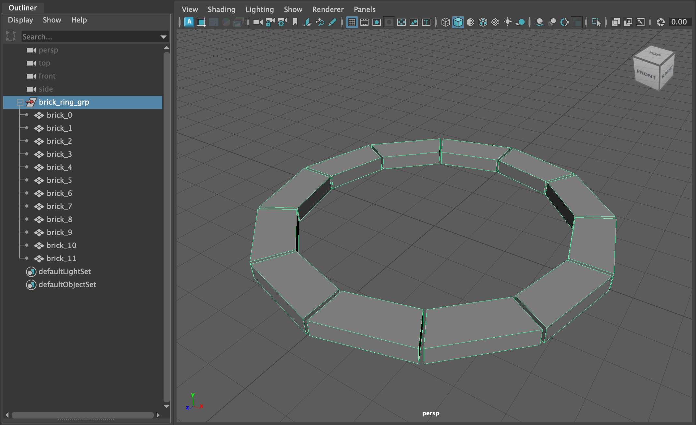
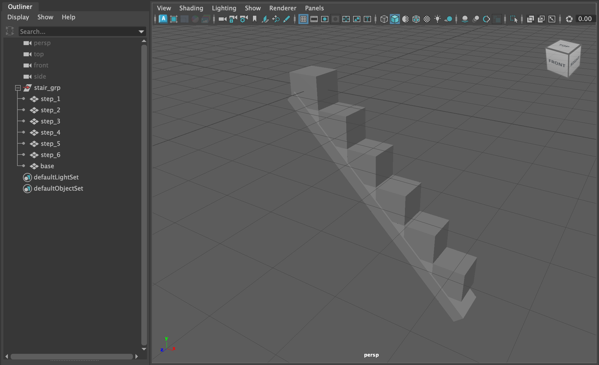
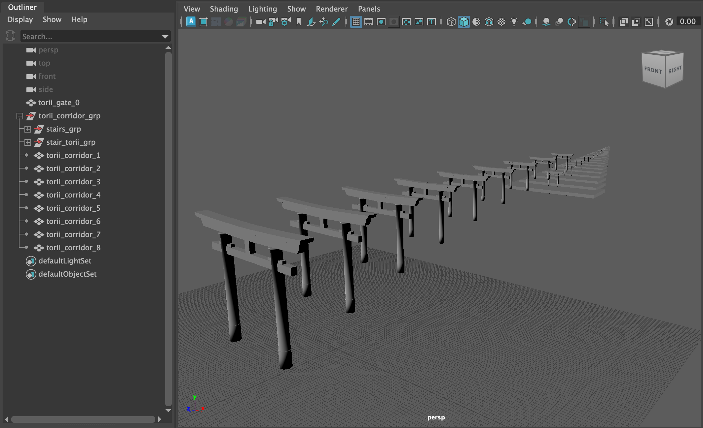

# Maya Procedural Animation Toolkit - Felipe Hidalgo

This project is a small Maya / PyMEL toolkit used to build environment geometry and drive procedural ball animations over infinite stair based layouts.

## Project Structure
- main.py
- objects/circle_bricks.py
- objects/infinite_stairs.py
- objects/torii_corridor.py
- animations/dynamic_ball.py
- animations/static_ball.py

## main.py
Acts as the entry point for the scene.

- Calls environment builders (stairs, torii corridor, brick ring)
- Triggers ball animations
- Defines separate runs for:
  - Primary ball using automatic stair traversal
  - Secondary ball using a custom step sequence

## circle_bricks.py
Creates a radial ring of brick meshes.

- Builds wedge shaped bricks using polygon facets
- Arranges bricks in a circle with small angular gaps
- Unites faces per brick and groups them under a single transform

## infinite_stairs.py
Builds a simple stair module.

- Creates stepped cubes with incremental rise and run
- Adds a diagonal base under the stairs
- Parents all parts under a single stair group

## torii_corridor.py
Builds a corridor of torii gates and stairs.

- Duplicates a base torii gate multiple times with spacing and scale decay
- Generates a staircase chain behind the corridor
- Optionally places torii gates along the stairs
- Groups all generated objects under one root node

*Notes*
- For this corridor to work, we need to have an intial `torii_gate_0` object rotated 90 deg in Y
- This `obj` can be found inside the `/assets` directory

## dynamic_ball.py
Main procedural animation system for balls bouncing on stairs.

- Reads ball rig controls and computes ball radius
- Collects bounce targets either:
  - Automatically from stair groups
  - Explicitly from a provided step sequence
- Distributes hop timing across a fixed animation range
- Animates each hop with:
  - Contact, squash, recover, hold, launch, impulse, apex and landing
- Applies squash and stretch based on constants and multipliers
- Computes rolling rotation from travel distance
- Handles special placement logic for `bottom-left` stairs
- Cleans animation curves (linear contacts, weighted apex tangents)

## static_ball.py
Simpler bounce animation for a ball on a flat surface.

- Generates a decaying bounce height sequence
- Keys vertical motion with squash and stretch
- Adds rolling based on bounce velocity
- Cleans tangents for contacts and peaks

## Animation Concepts

- **Targets**: Top stair positions the ball jumps between
- **Hops**: Each jump is a self contained timing block
- **Squash & Stretch**: Driven by scale on a dedicated controller
- **Jump Power**: Controls vertical impulse without changing timing
- **Hold Multiplier**: Extends squash duration to simulate strength
- **Roll**: Accumulated rotation based on travel distance

